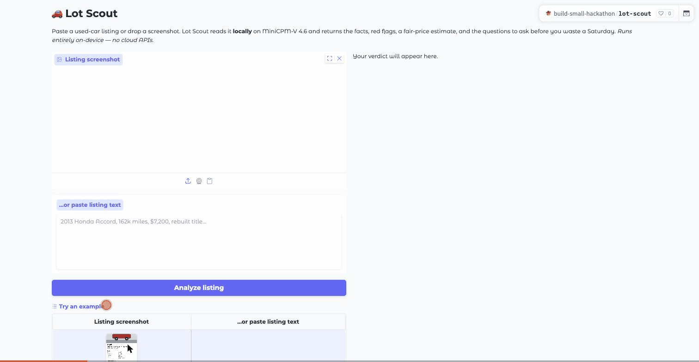

# 🚗 Lot Scout

**Spot the lemon before you drive across town.** Paste a used-car listing or drop a
screenshot — Lot Scout reads it *locally* on a ~1.3B vision-language model and hands back
the facts, the red flags, a fair-price estimate, and the questions to ask the seller.

▶️ **[Watch the demo](https://huggingface.co/spaces/build-small-hackathon/lot-scout/resolve/main/assets/demo/lot-scout-demo.mp4)** · **Model:** openbmb/MiniCPM-V-4.6 (1.3B) · runs on-device, no cloud APIs

> ⚠️ Estimate only — not financial or mechanical advice. AI-generated from a single listing; verify everything in person.

## 🎬 Demo



Above: a built-in example analyzed end-to-end on ZeroGPU in **~5 seconds** — facts, red
flags, a price check, and tailored seller questions. Try the three built-in examples (a
salvage-title Accord, a clean fair-priced Camry, and a too-good-to-be-true BMW shipping
scam) for a deterministic walkthrough.

**🏷️ Tiny Titan:** the whole app runs on a single **~1.3B** model (openbmb/MiniCPM-V-4.6) — well under the 4B bar.

**🎥 Demo video:** [lot-scout-demo.mp4](https://huggingface.co/spaces/build-small-hackathon/lot-scout/resolve/main/assets/demo/lot-scout-demo.mp4) (screen capture of a live run)
**📣 Social post:** https://x.com/austin_seb/status/2066348524619366750
**📝 Field notes (blog):** https://huggingface.co/blog/SebAustin/build-small-hackathon
**🔁 Shared agent traces:** https://huggingface.co/datasets/build-small-hackathon/lot-scout-traces

## The problem

Used-car listings are a minefield. The dangerous stuff — a rebuilt/salvage title buried in
the details, a price that's suspiciously low for the mileage, a "pay a deposit and I'll ship
it" scam — is easy to miss when you're scrolling Marketplace at 11pm. Buyers waste Saturdays
on cars that were never worth seeing, or worse, wire a deposit to a car that doesn't exist.

## The solution

Upload a screenshot or paste the text. Lot Scout runs a small, visible agent pipeline and
returns a single verdict card:

- **Facts** — year / make / model / trim / mileage / price / title status / location
- **🚩 Red flags** — salvage/rebuilt title language, price↔mileage mismatch, classic scam
  patterns (deposit-first, will-ship, no test drive, manufactured urgency), self-contradictions, missing info
- **💰 Fair-price estimate** — a model-reasoned market band (clearly labelled an estimate)
- **❓ 5 questions** to ask the seller, tailored to *this* listing's gaps
- **🚪 Walk-away price** — the most a smart buyer should pay given the risks

## Architecture — a real, visible agent loop

```
screenshot / text
      │
      ▼
 ① extract  (vision call)   → structured facts as JSON
      │
      ▼
 ② validate (rules)         → coerce types, normalize units, sanity-check ranges
      │
      ▼
 ③ red-flag (rules)         → title keywords, scam patterns, contradictions, missing info
      │                        (deterministic — fires independently of the model)
      ▼
 ④ price    (heuristic)     → depreciation-based ballpark + "too-good-to-be-true" check
      │                        (deterministic — links out to KBB/Edmunds for the real number)
      ▼
 ⑤ advise   (rules)         → 5 tailored seller questions + a sensible price ceiling
      │
      ▼
 ⑥ assemble                 → merge + dedupe flags, render verdict card
```

Each step logs its input/output to a `Trace` (exportable to a HF dataset for the Open Trace
badge). **Only the extract step calls the model** — a ~1.3B model reads listing images well
but recalls market prices and free-form judgment poorly, so pricing and advice are
deterministic and transparent rather than confidently wrong. This keeps the pipeline well
under the <10s target and makes the red-flag and price logic independent of model luck.

## Model

[**openbmb/MiniCPM-V-4.6**](https://huggingface.co/openbmb/MiniCPM-V-4.6) — ~1.3B params,
Apache-2.0, image-text-to-text. Loaded via `MiniCPMV4_6ForConditionalGeneration` +
`processor.apply_chat_template(...)` + `model.generate(...)` (the verified path from the
official demo Space — there is **no** `model.chat()` in 4.6).

## Runs local

All inference happens **in the Space** on the model above — **no cloud LLM APIs**. Drop the
same `app.py` on any CUDA box and it runs the same way (Off-the-Grid friendly).

## Setup (≤5 commands)

```bash
git clone https://huggingface.co/spaces/build-small-hackathon/lot-scout
cd lot-scout
pip install -r requirements.txt
python app.py            # needs a CUDA GPU (the Space uses ZeroGPU)
```

## Roadmap

- Export the per-run `Trace` to a HF dataset (Open Trace badge)
- VIN decode + recall lookup; market comps to ground the price band
- Batch mode: paste several listings, get a ranked shortlist
- Optional Modal endpoint for the inference core (Modal award)
